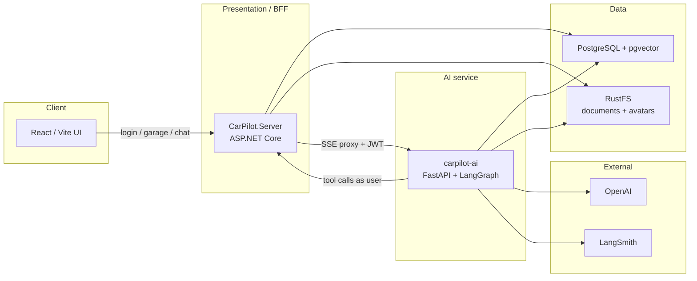
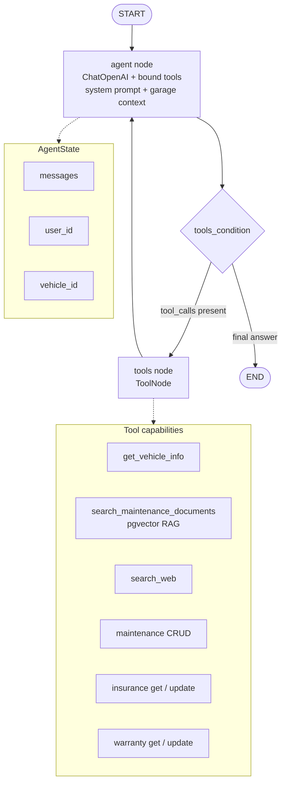
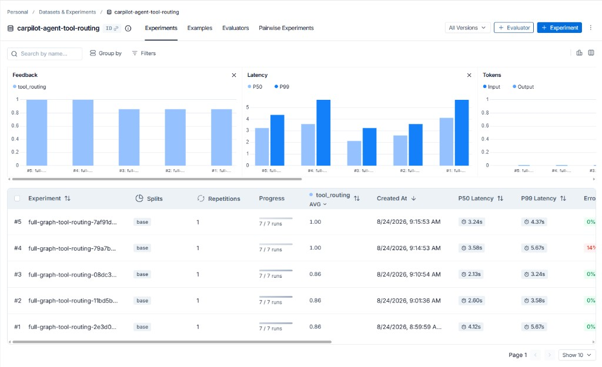

# CarPilot

**Live demo:** [https://server.icymoss-21622c0d.eastus.azurecontainerapps.io](https://server.icymoss-21622c0d.eastus.azurecontainerapps.io)

CarPilot is a personal vehicle garage: keep maintenance, warranty, insurance, and finance records in one place, then ask an AI assistant about them. The assistant can search your (redacted) documents, look things up on the web, and write garage records back through the API as the signed-in user.

## Why this shape

This is intentionally a **small distributed system**, not a single process that pretends AI, storage, and HTTP are the same concern. A React SPA needs a stable API and auth boundary. Garage CRUD and object storage belong in a typed .NET service with EF Core. Document RAG, tool-calling loops, Presidio redaction, and LangSmith evals live in the Python ecosystem where LangChain / LangGraph are first-class. Forcing all of that into one runtime would optimize for “one deploy unit” at the cost of the wrong language and libraries for half the product.

The trade-offs are real: more services mean more network hops, dual health checks, and two projects in different languages and frameworks (ASP.NET and Python) inside one Aspire repo. Those were accepted because the boundaries are clear (browser → BFF → agent → BFF again for scoped writes), each side can evolve independently, and failures stay localized—an agent timeout does not take down garage CRUD.

[**.NET Aspire**](https://learn.microsoft.com/dotnet/aspire/get-started/aspire-overview) is what makes that architecture practical. Locally it is the composition root: it **dockerizes** Postgres, pgvector, and [RustFS](https://rustfs.com/) (the open-source S3-compatible successor people reach for instead of MinIO), injects service discovery and connection strings, and runs the React, .NET, and Python processes as one application. The same AppHost model publishes to **Azure Container Apps**—so “distributed locally” and “distributed in cloud” are the same graph of resources, not two hand-maintained topologies. That is the point: Aspire turns multi-service from an ops burden into a first-class application model.

## Architecture



**Request path for chat:** the browser talks only to the .NET BFF. `POST /api/vehicles/{id}/assistant/ask/stream` proxies SSE to `carpilot-ai`. The AI service forwards the caller’s JWT on tool calls so garage writes stay scoped to that user.

**Ingestion (fail closed):** upload original file → private bucket → extract text → Presidio PII redaction → chunk + embed into pgvector. Unredacted text is not embedded.

Aspire’s AppHost is the local composition root (`CarPilot.AppHost/AppHost.cs`). It wires:

| Resource | Role |
|---|---|
| `webfrontend` | Vite React app; published into `wwwroot` for production |
| `server` | BFF: demo JWT auth, garage CRUD, chat proxy |
| `carpilot-ai` | LangGraph agent, RAG, document ingest |
| `postgres` / `carpilot` | Garage data + vectors (`pgvector/pgvector:pg17`) |
| `rustfs` | Open-source S3-compatible object store (MinIO replacement); buckets `documents` and `avatars` |

## Agent stack (LangChain, LangGraph, LangSmith)

`carpilot-ai` is a FastAPI service that hosts a **LangGraph** ReAct agent built on **LangChain** primitives (`ChatOpenAI`, `@tool`, message types). LangGraph owns the control loop; LangChain owns model/tool binding; **LangSmith** owns tracing and evaluation experiments.

### Graph and state

Every turn carries an `AgentState`:

| Field | Role |
|---|---|
| `messages` | Conversation turns (appended via LangGraph’s `add_messages` reducer) |
| `user_id` | Signed-in user — injected into tools / API calls |
| `vehicle_id` | Active vehicle — garage tools target this without the model inventing ids |

The compiled graph is a classic **agent ↔ tools** loop with a Postgres checkpointer (`AsyncPostgresSaver`) so multi-turn threads resume by `thread_id`:



1. **agent** prepends the system prompt and a garage-context system message (`user_id` / `vehicle_id`), then invokes the LLM with tools bound.
2. If the model emits tool calls, **tools** runs them (RAG, web search, or BFF CRUD with the forwarded JWT) and appends results to `messages`.
3. Control returns to **agent** until the model produces a final answer (`END`).
4. Checkpointer state is keyed by `thread_id`, so the next user message continues the same graph thread.

Garage-mutating tools never talk to the database as a privileged service account. They call the .NET API with the **caller’s JWT**, so permissions stay identical to what the user could do in the UI.

### LangSmith experiments

Live runs are traced to LangSmith (`LANGSMITH_TRACING=true`). Full-graph evals (`carpilot-ai/evals/run_full_graph_eval.py`) hit live `POST /chat`, score **tool routing** against dataset `carpilot-agent-tool-routing`, and publish experiments (prefix `full-graph-tool-routing-…`) you can compare for accuracy and latency:



More detail: [carpilot-ai/README.md](carpilot-ai/README.md).

## Authentication (demo JWT)

CarPilot uses a **demo JWT** issued by `CarPilot.Server` for the seeded user (John Smith). There is no external identity provider in this repo.

Why a JWT still matters—even in a demo:

- The browser authenticates once with the BFF; chat is proxied to `carpilot-ai` with that same bearer token.
- The agent **acts on behalf of the user**: every garage tool call reuses the JWT so authorization is user-scoped (vehicles and records the token’s subject owns), not “AI service can write anything.”
- That boundary is what you would extend later for **auditing and tracing**—attributes like `actor=user` vs `actor=agent`, tool name, and correlation id on each mutating API call—so you can answer “did the human or the assistant change this policy?” without inventing a separate privilege model.

| Setting | Purpose |
|---|---|
| `Auth:JwtSigningKey` | Symmetric HS256 signing key (min 32 chars). Local default is in `appsettings.json`; Azure gets `Parameters:auth-jwt-signing-key`. |
| `Auth:JwtIssuer` / `Auth:JwtAudience` | Token issuer/audience (`carpilot` / `carpilot-api`) |
| `DemoUser:*` | Seeded user id, email, password, display name |

Login accepts only the seeded demo credentials; registration is disabled. For a real product, swap issuance to a managed IdP while keeping the same forward-the-bearer-token pattern for the agent.

## Quickstart

### Prerequisites

- [Docker Desktop](https://www.docker.com/products/docker-desktop/) (Postgres and RustFS run as containers)
- [.NET 10 SDK](https://dotnet.microsoft.com/download)
- [Node.js](https://nodejs.org/) `^20.19.0` or `>=22.12.0`
- [Python 3.12+](https://www.python.org/downloads/) and [uv](https://docs.astral.sh/uv/) (Aspire launches the AI service with `AddUvicornApp(...).WithUv()`)
- An [OpenAI API key](https://platform.openai.com/api-keys). A [LangSmith](https://smith.langchain.com/) key is optional but recommended (tracing is on in the AppHost)

### 1. Clone and restore secrets

From the repo root:

```bash
dotnet user-secrets set Parameters:openai-api-key "sk-..." --project CarPilot.AppHost
dotnet user-secrets set Parameters:langchain-api-key "lsv2-..." --project CarPilot.AppHost
```

For Azure deploy, also set a JWT signing key (32+ characters):

```bash
dotnet user-secrets set Parameters:auth-jwt-signing-key "your-long-random-signing-key...." --project CarPilot.AppHost
```

### 2. Run the AppHost

```bash
dotnet run --project CarPilot.AppHost
```

Aspire starts containers and services, then opens the dashboard. First boot can take a few minutes while images pull and the AI service downloads the spaCy model.

The HTTPS profile uses `https://carpilot.dev.localhost:17275` (see `CarPilot.AppHost/Properties/launchSettings.json`). Use the dashboard links if ports differ on your machine.

### 3. Sign in

Demo account (seeded garage + documents; form is prefilled):

- **Email:** `john.smith@carpilot.demo`
- **Password:** `demo`

### Optional: AI service tests

```bash
cd carpilot-ai
uv sync --extra dev
uv run python -m spacy download en_core_web_sm
uv run pytest
```

More agent/RAG detail lives in [carpilot-ai/README.md](carpilot-ai/README.md).

## Design notes

**Aspire as fabric.** Local orchestration and Azure Container Apps publish share one AppHost graph. Dockerized Postgres + RustFS, injected references, health checks, and parameter secrets mean the multi-service layout is the product’s default—not an afterthought bolted on for cloud.

**BFF in ASP.NET — DI and layering.** Controllers stay thin: auth, vehicles, maintenance, conversations, and the assistant stream. They depend on interfaces registered in `Program.cs` (`AddScoped` for request-bound work, `AddSingleton` for S3):

- **Controllers** — HTTP concerns (routes, status codes, binding). Example: `VehiclesController` / `AssistantController`.
- **Services** — use cases and orchestration (`IGarageService`, `IAssistantService`, `IFileUploadService`). The assistant service proxies SSE and forwards the caller’s JWT; garage services enforce vehicle ownership via `ICurrentUser`.
- **Repositories** — data access behind `IGarageRepository` / `EfGarageRepository` so EF Core does not leak into controllers.
- **Cross-cutting** — `IObjectStorageService`, embedding/index helpers, JWT auth, and typed `HttpClient` for `carpilot-ai`.

That controller → service → repository split keeps authorization and persistence testable without spinning up the full HTTP pipeline for every garage rule, while still remaining a pragmatic BFF rather than a full Clean Architecture portfolio.

**Python for the agent.** LangGraph, pgvector RAG, Presidio, and LangSmith are the usual Python stack. Aspire’s Python hosting (`WithUv`, health checks, references to Postgres, the BFF, and RustFS) keeps that service first-class beside .NET.

**What the app is today.** A single-user garage (vehicles, maintenance, warranty, insurance, finance) plus an assistant that can RAG over uploaded docs, search the web, and CRUD records. Document ingest redacts PII before embeddings.

## What I would improve with more time

**Auth.** Replace demo JWT issuance with a **managed IdP** (Clerk, Entra ID, Auth0, Cognito, etc.) while keeping the agent’s forward-bearer pattern. Add explicit **agent vs user** audit fields on mutating writes.

**API-first platform.** Move toward a more deliberate HTTP surface inspired by kits like [fullstackhero](https://fullstackhero.net/): **versioned routes** (`/api/v1/...`), shared **request/response contracts**, consistent **pagination**, and **base entities** for auditable records (created/updated by, timestamps, soft delete). Consider **[Finbuckle](https://www.finbuckle.com/MultiTenant)** (or equivalent) early if the product grows into fleet / multi-tenant garage ownership.

**Observability & quality.** Richer **OpenTelemetry** across the BFF and `carpilot-ai` (traces, metrics, and baggage for `user_id` / `thread_id` / tool names), plus more **unit and integration tests** on both the .NET and Python sides—not only LangSmith tool-routing evals.

**Code organization.** Push the .NET side further toward clearer Application / Infrastructure boundaries (use-case handlers, pipeline behaviors) so garage and assistant logic stay testable without HTTP or EF. The React app would get the same treatment: clearer feature folders, stronger TanStack Query caching, and less provider-level coupling.

**Product — vertical.** Grow into **fleet management**: businesses managing many vehicles, with automated maintenance reminders and schedules.

**Product — horizontal.** Cover more of the **buy/sell journey**:

- A search / negotiator that uses internally uploaded purchase and warranty documents, **anonymized across customers**, to tell a buyer whether a dealership or private-seller offer is reasonable.
- Turn a full maintenance history into a **for-sale listing** (marketplace-style) without leaving CarPilot.
- Let shoppers **ask the AI about a listed car** and get grounded answers from that vehicle’s records and documents.
