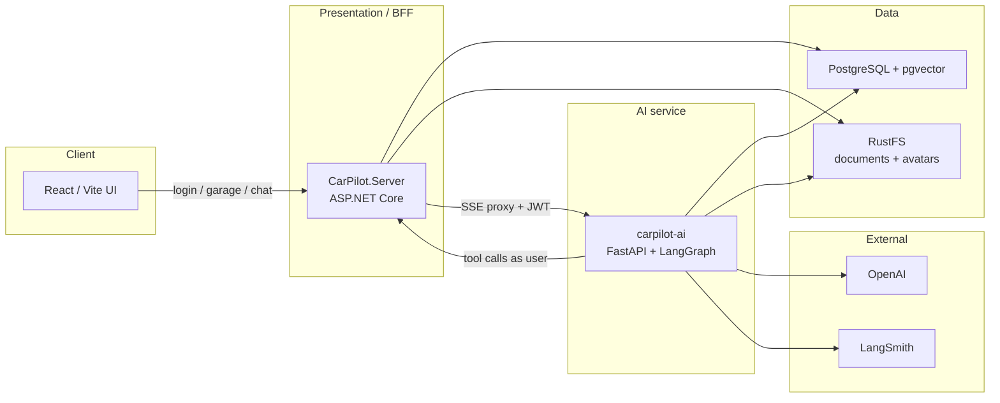

# CarPilot

CarPilot is a personal vehicle garage: keep maintenance, warranty, insurance, and finance records in one place, then ask an AI assistant about them. The assistant can search your (redacted) documents, look things up on the web, and write garage records back through the API as the signed-in user.

Locally, [**.NET Aspire**](https://learn.microsoft.com/dotnet/aspire/get-started/aspire-overview) runs the whole distributed stack—React UI, ASP.NET BFF, Python LangGraph service, PostgreSQL + pgvector, and S3-compatible object storage—so you do not hand-manage connection strings between services.

## Architecture



**Request path for chat:** the browser talks only to the .NET BFF. `POST /api/vehicles/{id}/assistant/ask/stream` proxies SSE to `carpilot-ai`. The AI service forwards the caller’s JWT on tool calls so garage writes stay scoped to that user.

**Ingestion (fail closed):** upload original file → private bucket → extract text → Presidio PII redaction → chunk + embed into pgvector. Unredacted text is not embedded.

Aspire’s AppHost is the local composition root (`CarPilot.AppHost/AppHost.cs`). It wires:

| Resource | Role |
|---|---|
| `webfrontend` | Vite React app; published into `wwwroot` for production |
| `server` | BFF: demo JWT auth, garage CRUD, chat proxy |
| `carpilot-ai` | LangGraph agent, RAG, document ingest |
| `postgres` / `carpilot` | Garage data + vectors (`pgvector/pgvector:pg17`) |
| `rustfs` | S3-compatible buckets `documents` and `avatars` |

## Authentication (demo JWT — no Keycloak)

CarPilot does **not** run Keycloak (or any external IdP) in local Aspire or on Azure.

Instead, `CarPilot.Server` uses **demo auth**:

- Login accepts only the seeded demo user credentials.
- The server issues HS256 JWTs (`Auth:JwtSigningKey`) that the API validates itself.
- The garage seed for John Smith is applied on startup (`DbInitializer`).
- New account registration is disabled in this mode.

| Setting | Purpose |
|---|---|
| `Auth:JwtSigningKey` | Symmetric signing key (min 32 chars). Local default is in `appsettings.json`; Azure gets `Parameters:auth-jwt-signing-key`. |
| `Auth:JwtIssuer` / `Auth:JwtAudience` | Token issuer/audience (`carpilot` / `carpilot-api`) |
| `DemoUser:*` | Seeded user id, email, password, display name |

This keeps Azure Container Apps simple (no Keycloak container, realm import, or internal HTTPS IdP hops). For a real product, replace demo auth with a managed IdP (Clerk, Entra ID, Auth0, etc.).

## Quickstart

### Prerequisites

- [Docker Desktop](https://www.docker.com/products/docker-desktop/) (Postgres and RustFS run as containers)
- [.NET 10 SDK](https://dotnet.microsoft.com/download)
- [Node.js](https://nodejs.org/) `^20.19.0` or `>=22.12.0`
- [Python 3.12+](https://www.python.org/downloads/) and [uv](https://docs.astral.sh/uv/) (Aspire launches the AI service with `AddUvicornApp(...).WithUv()`)
- An [OpenAI API key](https://platform.openai.com/api-keys). A [LangSmith](https://smith.langchain.com/) key is optional but recommended (tracing is on in the AppHost)

### 1. Clone and restore secrets

From the repo root:

```bash
dotnet user-secrets set Parameters:openai-api-key "sk-..." --project CarPilot.AppHost
dotnet user-secrets set Parameters:langchain-api-key "lsv2-..." --project CarPilot.AppHost
```

For Azure deploy, also set a JWT signing key (32+ characters):

```bash
dotnet user-secrets set Parameters:auth-jwt-signing-key "your-long-random-signing-key...." --project CarPilot.AppHost
```

### 2. Run the AppHost

```bash
dotnet run --project CarPilot.AppHost
```

Aspire starts containers and services, then opens the dashboard. First boot can take a few minutes while images pull and the AI service downloads the spaCy model.

The HTTPS profile uses `https://carpilot.dev.localhost:17275` (see `CarPilot.AppHost/Properties/launchSettings.json`). Use the dashboard links if ports differ on your machine.

### 3. Sign in

Demo account (seeded garage + documents; form is prefilled):

- **Email:** `john.smith@carpilot.demo`
- **Password:** `demo`

### Optional: AI service tests

```bash
cd carpilot-ai
uv sync --extra dev
uv run python -m spacy download en_core_web_sm
uv run pytest
```

More agent/RAG detail lives in [carpilot-ai/README.md](carpilot-ai/README.md).

## Design notes

**Aspire as the local (and intended cloud) fabric.** The product is a small distributed system: a React SPA, a .NET BFF, and a Python agent, plus a relational store with vectors and blob storage. Aspire dockerizes backing services, injects references so the BFF and AI process do not copy connection strings around, and already has a deployment story for .NET + containers.

**BFF in ASP.NET.** The browser never talks to the AI service directly for garage writes. The server issues/validates JWTs, owns EF Core and S3, and proxies the assistant SSE stream. That keeps CORS, tokens, and authorization in one place and lets Python tools mutate data as the same user.

**Demo JWT instead of Keycloak.** Self-hosted Keycloak on Azure Container Apps was unreliable (empty bind-mount shares, H2 corruption on Azure Files, flaky internal HTTPS). For this demo app, server-issued JWTs for a seeded user are enough. Swap in a managed IdP when you need real multi-user auth.

**Python for the agent.** LangGraph, pgvector RAG, Presidio, and LangSmith are the usual Python ecosystem. Aspire’s Python hosting (`WithUv`, health checks, references to Postgres, the BFF, and RustFS) kept that service first-class in the same dashboard as the .NET process.

**Cloud direction.** Aspire-to-Azure is the intended deployment path for this repo. The AppHost already models the distributed system, so Azure Container Apps or another Aspire-supported Azure target is a better fit than hand-wiring each service on a non-Aspire platform.

**What the app is today.** A single-user garage (vehicles, maintenance, warranty, insurance, finance) plus an assistant that can RAG over uploaded docs, search the web, and CRUD records. Document ingest redacts PII before embeddings.

## What I would improve with more time

**Auth.** Replace demo JWT auth with a **managed IdP** (Clerk, Entra ID, Auth0, Cognito, etc.) so token issuance, MFA, and secret rotation are not a hardcoded demo user.

**Code organization.** Move the .NET side toward [Clean Architecture](https://cleanarchitecture.jasontaylor.dev/docs/architecture/) (Domain / Application / Infrastructure / Presentation, use-case handlers, pipeline behaviors) so the garage and assistant stay testable without HTTP or EF. The React app would get the same treatment: clearer feature folders, stronger TanStack Query caching, and less provider-level coupling.

**Cloud.** Prefer **Azure** with Aspire-managed deployment, plus managed **Postgres** and **blob storage**, rather than manually wiring each service and secret by hand.

**Product — vertical.** Grow into **fleet management**: businesses managing many vehicles, with automated maintenance reminders and schedules.

**Product — horizontal.** Cover more of the **buy/sell journey**:

- A search / negotiator that uses internally uploaded purchase and warranty documents, **anonymized across customers**, to tell a buyer whether a dealership or private-seller offer is reasonable.
- Turn a full maintenance history into a **for-sale listing** (marketplace-style) without leaving CarPilot.
- Let shoppers **ask the AI about a listed car** and get grounded answers from that vehicle’s records and documents.
